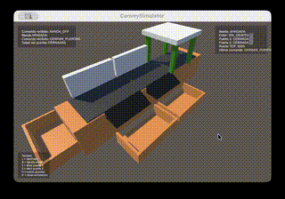

# 🎛️ Convey - Sistema Clasificador de Objetos por Color


---

## 🏫 Universidad Autónoma de Tamaulipas  
### Facultad de Ingeniería y Ciencias  
**Materia:** Programación Estructurada  
**Docente:** Dr. Alan Díaz Manríquez  

---

## 📌 Descripción

**Convey** es una librería en C diseñada para controlar un sistema clasificador de objetos por color, tanto en un entorno:

- 🖥️ **Simulado** mediante TCP
- ⚙️ **Físico** mediante comunicación serial con Arduino

El propósito principal de este proyecto es que los alumnos desarrollen la lógica del sistema utilizando programación estructurada, sin preocuparse por los detalles internos de la comunicación con el simulador o el hardware real.

Convey permite escribir un solo programa principal en C y reutilizarlo en ambos escenarios cambiando únicamente la forma en que se inicializa la conexión.

---

## 🎬 Vista previa del simulador

A continuación se muestra una vista previa de **ConveySimulator** en ejecución:



La animación muestra el funcionamiento general del sistema, incluyendo:

- Movimiento de la banda transportadora

- Detección de color

- Apertura y cierre de compuertas

- Clasificación de objetos

- Interfaz visual del simulador

---

## 📚 Tabla de contenidos

- [Objetivo del Proyecto](#-objetivo-del-proyecto)
- [Características](#-características)
- [Lógica de Clasificación](#-lógica-de-clasificación)
- [Arquitectura General](#-arquitectura-general)
- [Quick Start](#-quick-start)
  - [Uso con simulador](#uso-con-simulador)
  - [Uso con sistema físico](#uso-con-sistema-físico)
- [Estructura del Programa del Alumno](#-estructura-del-programa-del-alumno)
  - [Modo Automático](#️-modo-automático)
  - [Modo Manual](#-modo-manual)
  - [Estadísticas](#-estadísticas)
  - [Historial Circular](#-historial-circular)
  - [Reinicio de Datos](#-reinicio-de-datos)
- [API de la Librería](#-api-de-la-librería)
- [Compilación](#-compilación)
- [ConveySimulator](#Convey#%EF%B8%8F-conveysimulator)
- [Documentación](#-documentación)
- [Starter Code para Alumnos](#-starter-code-para-alumnos)
- [Evaluación del Proyecto](#-evaluación-del-proyecto)
- [Cronograma](#-cronograma)
- [Entregables](#-entregables)
- [Créditos](#-créditos)

---

## 🎯 Objetivo del Proyecto

Desarrollar en lenguaje C un sistema completo de control para clasificar objetos por color, integrando los conocimientos vistos en la materia, tales como:

- Estructuras condicionales
- Estructuras repetitivas
- Funciones
- Arreglos
- Historial circular
- Estadísticas
- Menús interactivos
- Comunicación con dispositivos externos

El programa desarrollado por el alumno deberá ser capaz de controlar la banda, leer el color del objeto y decidir a qué destino debe enviarlo.

---

## ✨ Características

- API simple en C
- Soporte para **TCP** y **serial**
- Misma lógica para simulador y hardware real
- Funciones portables de teclado
- Compatible con Windows, Linux y macOS
- Ideal para prácticas de programación estructurada
- Documentación generada con Doxygen
- Fácil integración con programas hechos por alumnos

---

## 🧠 Lógica de Clasificación

La clasificación básica del sistema es:

| Color detectado | Acción |
|-----------------|--------|
| 🔴 Rojo         | Abrir **Puerta 1** |
| 🟢 Verde        | Abrir **Puerta 2** |
| 🟡 Amarillo     | No abrir compuerta, continúa a **Box_3** |

---

## 🏗️ Arquitectura General

### 1. Modo Simulado

```text
Programa en C --> TCP --> ConveySimulator
```

### 2. Modo Físico

```text
Programa en C --> Serial --> Arduino / Sistema físico
```

La librería `convey` se encarga de ocultar estos detalles, de modo que el código principal del alumno sea el mismo en ambos casos.

---

## 🚀 Quick Start

### Uso con simulador

```c
#include <stdio.h>
#include "convey.h"

int main(void)
{
    if (inicializarConexionTCP("127.0.0.1", 5000) != 0) {
        printf("Error de conexion\n");
        return 1;
    }

    if (encenderBanda() == 0) {
        printf("Banda encendida\n");
    }

    printf("Color detectado: %d\n", leerColor());

    apagarBanda();
    cerrarConexion();
    restaurarTerminal();

    return 0;
}
```

### Uso con sistema físico

#### macOS / Linux

```c
#include <stdio.h>
#include "convey.h"

int main(void)
{
    if (inicializarConexionSerial("/dev/cu.usbserial-1140", 115200) != 0) {
        printf("Error de conexion serial\n");
        return 1;
    }

    if (encenderBanda() == 0) {
        printf("Banda encendida\n");
    }

    printf("Color detectado: %d\n", leerColor());

    apagarBanda();
    cerrarConexion();
    restaurarTerminal();

    return 0;
}
```

#### Windows

```c
#include <stdio.h>
#include "convey.h"

int main(void)
{
    if (inicializarConexionSerial("COM5", 115200) != 0) {
        printf("Error de conexion serial\n");
        return 1;
    }

    if (encenderBanda() == 0) {
        printf("Banda encendida\n");
    }

    printf("Color detectado: %d\n", leerColor());

    apagarBanda();
    cerrarConexion();
    restaurarTerminal();

    return 0;
}
```

---

## 🧩 Estructura del Programa del Alumno

El programa que desarrollen los alumnos debe incluir al menos un menú principal con las siguientes opciones.

### ⚙️ Modo Automático

En este modo el sistema debe:

- Encender la banda
- Leer continuamente el color
- Detectar cuándo aparece un nuevo objeto
- Clasificarlo automáticamente
- Salir del ciclo al presionar una tecla, por ejemplo `q`

### 🎮 Modo Manual

Debe permitir operar el sistema manualmente mediante un menú con opciones como:

- Encender banda
- Apagar banda
- Leer color
- Abrir puerta 1
- Abrir puerta 2
- Cerrar puerta 1
- Cerrar puerta 2
- Cerrar todas las puertas

### 📊 Estadísticas

El programa debe llevar un conteo de:

- Total de objetos procesados
- Cantidad de objetos rojos
- Cantidad de objetos verdes
- Cantidad de objetos amarillos
- Porcentaje de cada color

### 🔄 Historial Circular

El historial debe implementarse con arreglos de tamaño fijo y funcionar como buffer circular.

Debe almacenar, por ejemplo:

- Color detectado
- Destino al que se envió el objeto

### 🔁 Reinicio de Datos

El programa debe permitir:

- Reiniciar estadísticas
- Limpiar historial
- Apagar la banda
- Cerrar las compuertas

---

## 🔌 API de la Librería

### Inicialización

```c
int inicializarConexionTCP(const char* host, int puerto);
int inicializarConexionSerial(const char* puerto, int baudrate);
int cerrarConexion(void);
```

### Control del sistema

```c
int encenderBanda(void);
int apagarBanda(void);
int leerColor(void);
int abrirPuerta(int puerta);
int cerrarPuerta(int puerta);
int cerrarPuertas(void);
```

### Teclado portable

```c
int teclaDisponible(void);
int leerTecla(void);
void restaurarTerminal(void);
```

---

## 🛠️ Compilación

### macOS / Linux

```bash
gcc main.c convey.c -o programa
```

o

```bash
clang main.c convey.c -o programa
```

### Windows (MinGW)

```bash
gcc main.c convey.c -o programa.exe -lws2_32
```

> En Windows, `-lws2_32` es necesario para soporte TCP.

---

## 🖥️ ConveySimulator

**ConveySimulator** es la aplicación visual utilizada para probar el sistema sin necesidad del hardware real.

Incluye:

- Banda transportadora
- Sensor de color
- Compuertas
- Cajas de clasificación
- Interfaz visual
- Indicadores de estado
- Paneles de depuración
- Comunicación por TCP con programas en C

### 💿 Instalador

Se encuentra disponible la primera versión del instalador de **ConveySimulator**, el cual permite ejecutar el simulador de forma independiente sin necesidad de abrir Unity.

👉 **Descarga directa:**

- 🍎 **macOS**  
  [ConveySimulator.dmg](https://github.com/calix35/Convey/releases/download/v1.0.0/ConveySimulator.dmg)

- 🪟 **Windows**  
  [ConveySimulator.msi](https://github.com/calix35/Convey/releases/download/v1.0.0/ConveySimulator.msi)

---

### 📥 Instrucciones de instalación (macOS)

1. Descargar el archivo `.dmg`
2. Abrir el archivo
3. Arrastrar **ConveySimulator.app** a la carpeta **Applications**
4. Ejecutar la aplicación

> ⚠️ Es posible que macOS muestre una advertencia de seguridad. En ese caso:
> - Ir a **Preferencias del Sistema → Privacidad y Seguridad**
> - Permitir la ejecución de la aplicación

---

### 📥 Instrucciones de instalación (Windows)

1. Descargar el archivo `.msi`
2. Ejecutar el instalador
3. Seguir los pasos del asistente de instalación
4. Ejecutar **ConveySimulator** desde el menú inicio o acceso directo

> ⚠️ En algunos casos, Windows puede mostrar una advertencia de seguridad (SmartScreen):
> - Seleccionar **"Más información"**
> - Luego hacer clic en **"Ejecutar de todas formas"**

---

### 🚧 Notas

- Este instalador corresponde a una versión inicial del simulador.
- Próximamente se añadirá:
  - Instalador nativo para Windows (`.exe`)
  - Mejoras en la distribución multiplataforma
  - Automatización del proceso de instalación

---

## 📚 Documentación

La documentación técnica de la librería fue generada con **Doxygen**.

Puedes consultarla aquí:

- 🔗 [Documentación HTML](https://calix35.github.io/Convey/)

La documentación incluye:

- Descripción de funciones
- Parámetros
- Valores de retorno
- Constantes
- Navegación HTML

---

## 🧪 Starter Code para Alumnos

Una base mínima para empezar podría ser:

```c
#include <stdio.h>
#include "convey.h"


int main(void)
{
    int color;

    if (inicializarConexionTCP("127.0.0.1", 5000) != 0) {
        printf("Error al conectar\n");
        return 1;
    }

    encenderBanda();

    while (1) {
        color = leerColor();

        if (color == COLOR_RED) {
            abrirPuerta(1);
        } else if (color == COLOR_GREEN) {
            abrirPuerta(2);
        } else if (color == COLOR_YELLOW) {
            cerrarPuertas();
        }

        if (teclaDisponible()) {
            int c = leerTecla();
            if (c == 'q' || c == 'Q') {
                break;
            }
        }
    }

    apagarBanda();
    cerrarPuertas();
    cerrarConexion();
    restaurarTerminal();

    return 0;
}
```

---

## 📝 Evaluación del Proyecto

El programa será evaluado con base en:

- Implementación correcta de la lógica de clasificación
- Uso de funciones
- Uso de estructuras condicionales y repetitivas
- Menú interactivo
- Estadísticas
- Historial circular
- Modo automático y modo manual
- Organización y claridad del código
- Correcta compilación y ejecución

> **Nota:** Aunque el proyecto puede realizarse en equipo, la evaluación será individual.

---

## 📅 Cronograma

> **Lugar:** Por definir  
> **Fecha y hora de entrega:** DD/MM/AAAA - HH:MM horas  

### Fechas y horarios de presentación

| Fecha       | Horario         | Integrantes del equipo |
|-------------|-----------------|------------------------|
| DD/MM/AAAA  | HH:MM - HH:MM   |                        |
| DD/MM/AAAA  | HH:MM - HH:MM   |                        |
| DD/MM/AAAA  | HH:MM - HH:MM   |                        |
| DD/MM/AAAA  | HH:MM - HH:MM   |                        |
| DD/MM/AAAA  | HH:MM - HH:MM   |                        |
| DD/MM/AAAA  | HH:MM - HH:MM   |                        |

(Los horarios son aproximados; es responsabilidad del alumno estar pendiente de su horario.)

---

## 📦 Entregables

Cada equipo o alumno deberá entregar al menos:

1. `main.c`
2. `reporte.pdf`

### Estructura sugerida del reporte

- Portada
- Descripción del proyecto
- Explicación de la lógica de clasificación
- Estructuras utilizadas
- Estadísticas e historial
- Dificultades enfrentadas
- Evidencia visual (opcional)

---

## 👨‍💻 Créditos

Proyecto académico desarrollado para la materia de **Programación Estructurada**, enfocado en la construcción de lógica de control para un sistema clasificador de objetos por color en entorno simulado y físico.
